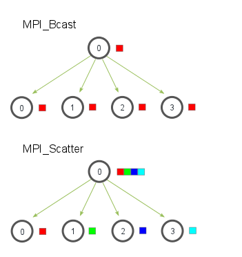

[Programação Paralela](https://github.com/AndreaInfUFSM/elc139-2019a) > Trabalho 6

### Professora: Andrea Charao
### Aluno: Henrique Velho

### Parte 1

	
[link parte 1](https://github.com/henrvelho/elc139-2019a/blob/master/trabalhos/t6/parte1.c)

O código original do problema da multiplicação de matrizes, era resolvido com chamadas de MPI_Send e MPI_Recv, realizando uma análise é possivel realizar o uso de MPI_Bcast e MPI_Scatter e no fim a união do resultado MPI_Gatter
Alguns aspectos importantes:

	MPI_Bcast: Ele envia a matriz B do root processo 0 para todos os outros.
	MPI_Scatter: Faz a divisão da matriz A e envia os dados aos outros processos com o mesmo root(raiz).
	MPI_Gatter: Realiza mesma operação do Scatter só que ao contrário, reune todos os outros processos em um só (root no caso).
	
Segue imagem ilustrativa:

### Parte 2

	soon