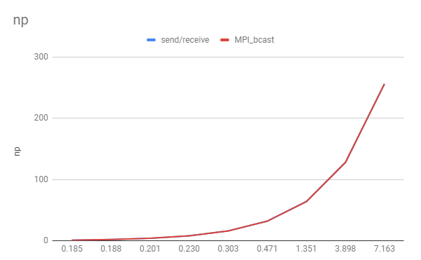
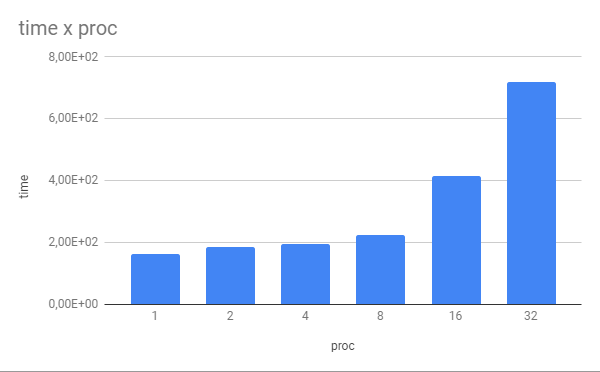
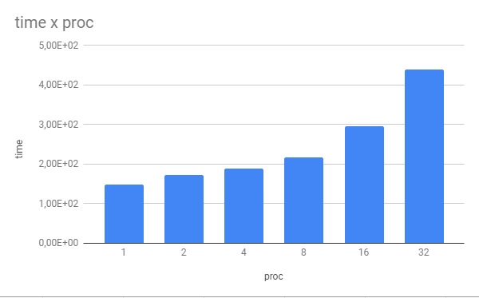
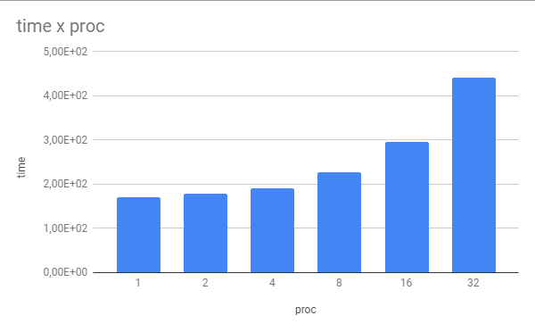

[Programação Paralela](https://github.com/AndreaInfUFSM/elc139-2019a) > Trabalho 5

### Professora: Andrea Charao
### Aluno: Henrique Velho

As referidas parte1 e parte2 deste trabalho foram executadas no processador corei5 3337u com 5,1GFlops 
Todos os resultados time, foram feitas 10 execuções e calculadas as medias resultantes.

### Parte 1

 Código fornecido [sr_bcast.c](sr_bcast.c)

 Código implementado [MPI_Bcast nativa](part1.c)

 

 **Resultados**

| send/recieve |          | MPI_bcast |          |   |
|--------------|----------|-------|----------|---|
| np           | time     | np    | time     |   |
| 1            | 0.185    | 1     | 0.161 |   |
| 2            | 0.188    | 2     | 0.169 |   |
| 4            | 0.201    | 4     | 0.219 |   |
| 8            | 0.230    | 8     | 0.289 |   |
| 16           | 0.303    | 16    | 0.289 |   |
| 32           | 0.471    | 32    | 0.422 |   |
| 64           | 1.351    | 64    | 1.163 |   |
| 128          | 3.898    | 128   | 3.035 |   |
| 256          | 7.163    | 256   | 6.813 |   |

### Parte 2

Executado o [avg.c](avg.c)
Variando bandwidth(bps) latencia, tamanho vetor e processos;

Gráfico 1: 
-Bandwidth 16 bps;
-latency 1000;
-tamanho vetor 3000;
Variando número de processos

Gráfico 2:
-Bandwith 512 bps;
-latency 1000;
-tamanho vetor 3000;
Variando número de processos

Gráfico 3:
-Bandwith 10000 bps;
-latency 4000;
-tamanho vetor 3000;
Variando número de processos

Abaixo segue em forma de tabela os dados obtidos:

| bandwidth(bps) | latency       | tam vetor | proc     | time  |
|----------------|---------------|-----------|----------|-------|
| 16             | 1000          | 3000      | 1        | 0.164 |
| 16             | 1000          | 3000      | 2        | 0.187 |
| 16             | 1000          | 3000      | 4        | 0.194 |
| 16             | 1000          | 3000      | 8        | 0.226 |
| 16             | 1000          | 3000      | 16       | 0.415 |
| 16             | 1000          | 3000      | 32       | 0.720 |
| 512            | 1000          | 3000      | 1        | 0.149 |
| 512            | 1000          | 3000      | 2        | 0.172 |
| 512            | 1000          | 3000      | 4        | 0.189 |
| 512            | 1000          | 3000      | 8        | 0.218 |
| 512            | 1000          | 3000      | 16       | 0.295 |
| 512            | 1000          | 3000      | 32       | 0.440 |
| 10000          | 4000          | 3000      | 1        | 0.170 |
| 10000          | 4000          | 3000      | 2        | 0.178 |
| 10000          | 4000          | 3000      | 4        | 0.190 |
| 10000          | 4000          | 3000      | 8        | 0.227 |
| 10000          | 4000          | 3000      | 16       | 0.295 |
| 10000          | 4000          | 3000      | 32       | 0.442 |

### Referências:

- [Tutorial MPI](https://computing.llnl.gov/tutorials/mpi/)
- [MPI Send and Receive](http://mpitutorial.com/tutorials/mpi-send-and-receive/)
- [Desempenho de programas MPI](https://docs.google.com/presentation/d/1FyeNpOu0-ISHycqqBKZwiE5Ewyon_YHg1E3x9dnMFH4/edit#slide=id.g35f391192_00)

